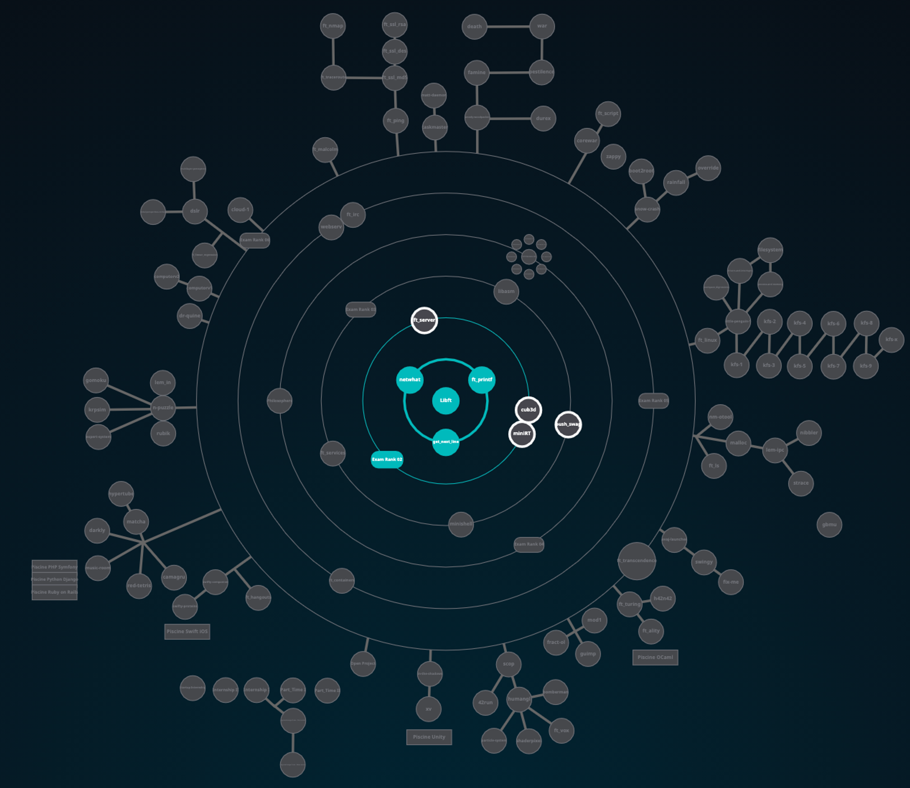

<strong>42 Cursus</strong> </br>
<div align="center">
  
</div>

# 1337 Piscine

Welcome to the 1337 Piscine repository – your coding adventure starts here!

## 🚀 Getting Started

1. **Clone this Repository:** 
   ```bash
   git clone https://github.com/sh1hvb/Pool-at-1337-42-Network.git

2.Explore Modules:
Find organized modules with exercises, READMEs, and solutions.

3.Work on Exercises:
Dive into exercises with instructions and resources.

4.Submit Solutions:
Follow mentor guidelines for submissions.

5.Contribute (Optional):
Share your solutions or resources by creating pull requests. See Contributing for details.
 </br>

## 📁 Repository Structure  </br>

Here's how this repository is organized: </br>
Pool-at-1337-42-Network/  </br>
│  </br>
├── Shell01/ </br>
│   ├── ex00/ </br>
│   │   ├── main.c </br>
│   │   ├── ... </br>
│   │   └── README.md  </br>
│   ├── ex01/ </br>
│   ├── ...  </br>
│  </br>
├── C02/ </br>
│   ├── ...  </br>
│   </br>
├── ...  </br>
│   </br>
├── README.md  </br>
